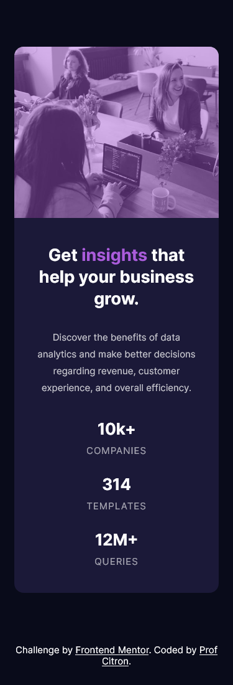

# Frontend Mentor - Stats preview card component solution

This is a solution to the [Stats preview card component challenge on Frontend Mentor](https://www.frontendmentor.io/challenges/stats-preview-card-component-8JqbgoU62). Frontend Mentor challenges help you improve your coding skills by building realistic projects.

## Table of contents

- [Overview](#overview)
    - [The challenge](#the-challenge)
    - [Screenshot](#screenshot)
    - [Links](#links)
- [My process](#my-process)
    - [Built with](#built-with)
    - [What I learned](#what-i-learned)
    - [Continued development](#continued-development)
    - [Useful resources](#useful-resources)
- [Author](#author)
- [Acknowledgments](#acknowledgments)

**Note: Delete this note and update the table of contents based on what sections you keep.**

## Overview

### The challenge

Users should be able to:

- View the optimal layout depending on their device's screen size


### Screenshot

The screenshots were created to the following widths:

- Mobile: 375px
- Desktop: 1440px




### Links

- Solution URL: [https://www.frontendmentor.io/challenges/stats-preview-card-component-8JqbgoU62/hub/card-component-with-flexbox-xv9GnIXsL](https://www.frontendmentor.io/challenges/stats-preview-card-component-8JqbgoU62/hub/card-component-with-flexbox-xv9GnIXsL)
- Live Site URL: [https://profcitron.github.io/frontendmentor-StatsPreviewCardComponent/](https://profcitron.github.io/frontendmentor-StatsPreviewCardComponent/)

## My process

### Built with

- Semantic HTML5 markup
- CSS custom properties
- CSS Variables  
- Flexbox
- CSS Grid (Only for centering in desktop mode)

### What I learned

An interesting CSS function is `calc` which is useful to build a 3 cols layout.

```css
.card__content-stats-item {
    flex-basis: calc(100% / 3);
}
```

### Continued development

I have mixed unit for my layouts (px and %). I don't really know how to master that, it will be my next improvement.

## Author

- Website - [Prof Citron](https://profcitron.fr)
- Frontend Mentor - [@yourusername](https://www.frontendmentor.io/profile/ProfCitron)